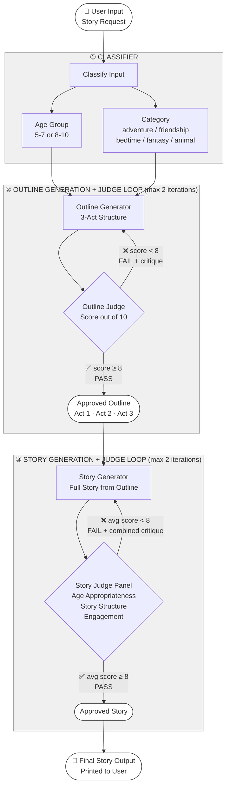

# System Block Diagram

## Component Descriptions

| Component | Role |
|---|---|
| **User** | Provides a natural language story request |
| **Classifier** | Detects age group (5-7 or 8-10) and story category from input |
| **Outline Generator** | Produces a 3-act story structure (setup, struggle, resolution) |
| **Outline Judge** | Scores outline on structure and age-appropriateness. Feeds critique back if score < 8 |
| **Story Generator** | Writes full story strictly following the approved outline |
| **Story Judge Panel** | Evaluates story across 3 dimensions: age appropriateness, story structure, engagement |
| **Refinement Loop** | Rewrites story using combined critique from all 3 judges if score < 8 |

## Prompting Strategies

| Strategy | Where Used |
|---|---|
| Chain-of-Thought (CoT) | Outline Judge, Story Judge — reason before scoring |
| Structured JSON output | All LLM calls — reliable parsing, no free text |
| Critique-driven refinement | Outline + Story loops — targeted fixes, not full regeneration |
| Separated system/user prompts | All components — clear role separation |
| Temperature control | Low (0.1) for judges/classifier, High (0.7-0.8) for generation |
